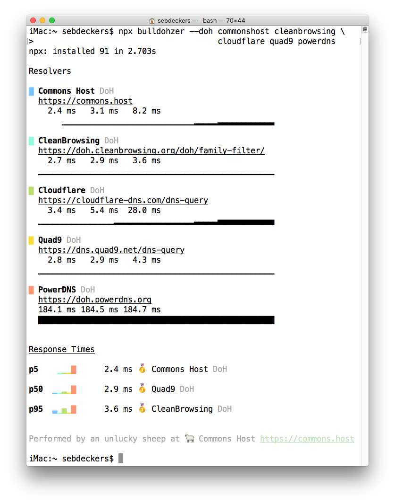

# bulldohzer 🚜

Find the fastest DNS or DoH resolver for you.

**Bulldohzer** is a performance measurement tool for DNS. It supports DNS-over-HTTPS (DoH) and DNS-over-UDP (Do53).

```shell
$ bulldohzer --doh commonshost cleanbrowsing \
                   cloudflare quad9 powerdns
```



## Introduction

Many public DNS benchmark reports measure from test machines in datacentres to DNS servers in datacentres. Good for marketing but irrelevant for end users. The best benchmark is the one you run yourself from your network on your device.

Traditional DNS is heavily optimised due to decades of widespread use. Unfortunately it is susceptible to tampering and monitoring. DoH is a new and secure DNS protocol. DoH transports DNS over long-lived HTTP/2 connections. Because DoH is so new, some implementations are not yet optimised nor widely deployed.

Benchmarking DoH resolvers can help implementors and operators to improve services for users. Feel free to share your findings. *"If you can not measure it, you can not improve it."*

Bulldohzer reports measurements in a human friendly table with graphs (`--report`), or export as JSON for developers and machines alike (`--json`).

## Imaginary Property Rights

All content in this repository is published under the [ISC License](https://opensource.org/licenses/ISC).

Made with ❤️ by [Sebastiaan Deckers](https://twitter.com/sebdeckers) for 🐑 [Commons Host](https://commons.host).
